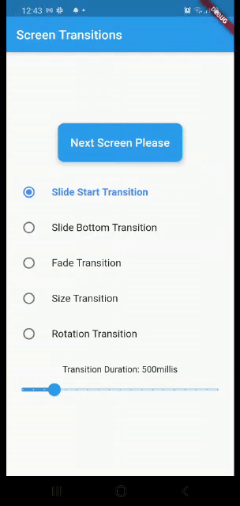

# screen_transitions

Animate routes easily with AnimatedRoute Helper class.

## Getting Started

It is very easy to has custom screen transition on Flutter, all you need to do is add a the transition type to your theme: 

```dart
MaterialApp(
   theme: ThemeData(
   pageTransitionsTheme: PageTransitionsTheme(builders: {
   TargetPlatform.iOS: CupertinoPageTransitionsBuilder(),
   TargetPlatform.android: CupertinoPageTransitionsBuilder(),
   }),
...
)
```

You can also define your own custom transition, I have implemented a simple helper class that make your life easier. 

```dart
Navigator.of(context).push(RouteAnimationHelper.createRoute(destination : Screen2(), animType: AnimType.slideStart, duration: 450, curve: Curves.ease));
```

You choose one of the following types: 
```dart
enum AnimType{
  slideStart, slideBottom, scale, size, fade, rotate, cubic
}
```



You can also supply a curve although Curves.ease - which is the default - is the best IMHO

- [Comments/Questions? contact me](https://www.geromino-apps.com)

